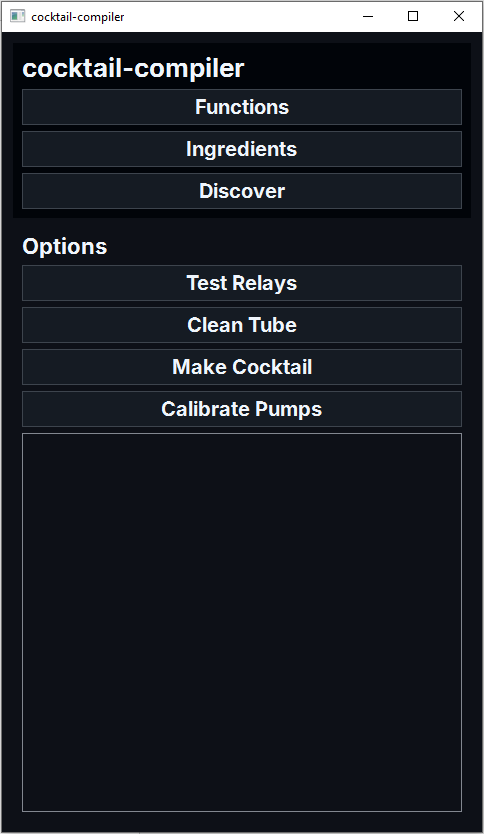
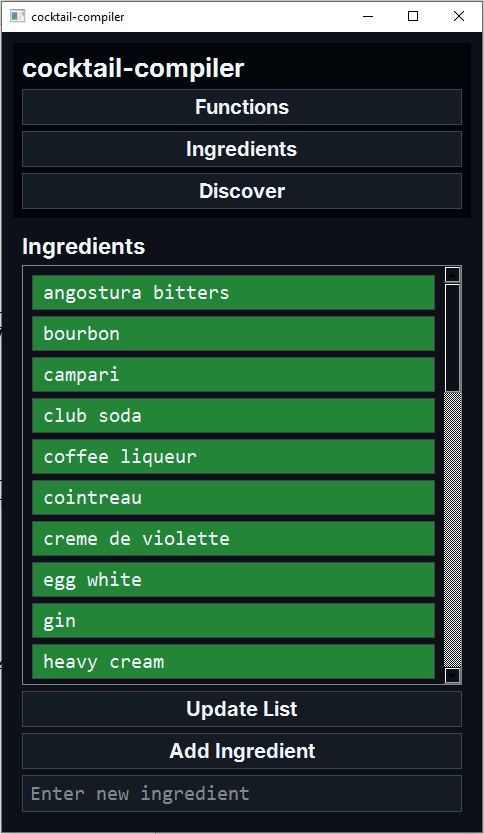
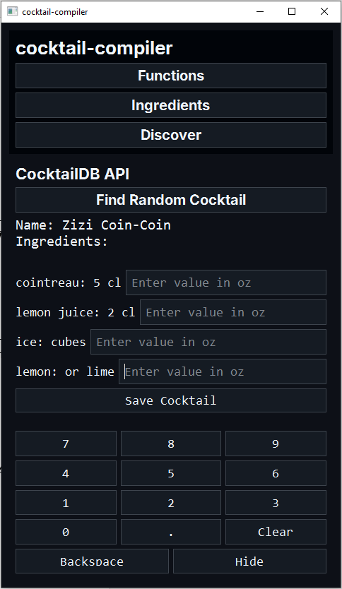

# cocktail-compiler

This repository contains the GUI and control logic for a smart bartender appliance. The appliance uses a Raspberry Pi, relay board, power supply, peristaltic pumps, and a 3D printed housing to automatically make cocktails for the user.

## Images

<div style="display: flex; justify-content: space-around;">
    
    
    
</div>

## Setup

1. Clone the repository:
    ```sh
    git clone https://github.com/yourusername/cocktail-compiler.git
    cd cocktail-compiler
    ```

2. Set up your Raspberry Pi with the necessary GPIO configurations.

3. Install the required Python packages:
    ```sh
    pip install -r requirements.txt
    ```

## PyQt6 on Raspberry Pi

Setting up PyQt6 on a Raspberry Pi can be somewhat tricky. You will have to install and compile PyQt6 from source, and instructions can be found [here](https://www.linkedin.com/pulse/install-pyqt6-raspberry-pi-5-maryam-del-mar-correa-9phse). Please note that **this process could take several hours** with a microSD card.

## Dependencies

- certifi==2025.1.31
- charset-normalizer==3.4.1
- idna==3.10
- PyQt6==6.8.1
- PyQt6-Qt6==6.8.2
- PyQt6_sip==13.10.0
- qt6-applications==6.5.0.2.3
- requests==2.32.3
- RPi.GPIO==0.7.1
- urllib3==2.3.0
  
## Usage

1. Ensure your Raspberry Pi is properly connected to the pumps via GPIO pins.

2. Run the `main.py` script to test the pumps:
    ```sh
    python3 gui/main.py
    ```

**Note:** Ensure you follow all safety guidelines when working with electrical components and liquids.