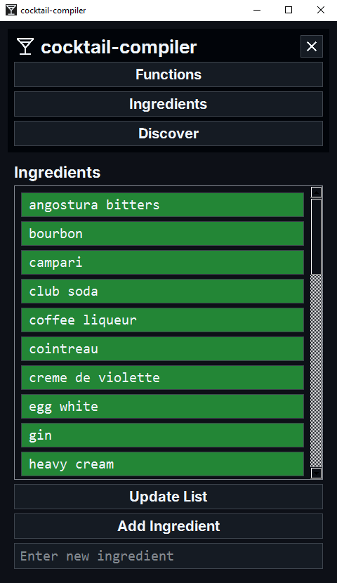

# cocktail-compiler

This repository is used for testing the pumps and Raspberry Pi functionality for the Cocktail Compiler project. The project aims to automate the process of making cocktails using a Raspberry Pi and connected pumps.

## Images





## Setup

1. Clone the repository:
    ```sh
    git clone https://github.com/yourusername/cocktail-compiler.git
    cd bartender-testing
    ```

2. Set up your Raspberry Pi with the necessary GPIO configurations.

3. Install the required Python packages:
    ```sh
    pip install -r requirements.txt
    ```

## Dependencies

- certifi==2025.1.31
- charset-normalizer==3.4.1
- idna==3.10
- PyQt6==6.8.1
- PyQt6-Qt6==6.8.2
- PyQt6_sip==13.10.0
- qt6-applications==6.5.0.2.3
- requests==2.32.3
- urllib3==2.3.0

## Usage

1. Ensure your Raspberry Pi is properly connected to the pumps via GPIO pins.

2. Run the `test_relays.py` script to test the pumps:
    ```sh
    python test_relays.py
    ```

3. Follow the prompts to enter the amount to pour or the cocktail name.

## Files

- `test_relays.py`: Script to test the relays and pumps.
- `cocktails_data.py`: Contains the list of cocktails and their ingredients.
- `.gitignore`: Specifies files and directories to be ignored by Git.
- `requirements.txt`: Lists the Python dependencies for the project.

**Note:** This project is intended for testing purposes only. Ensure you follow all safety guidelines when working with electrical components and liquids.

## OLD GUI CODE
```python
import sys
import csv
from PyQt6.QtWidgets import QApplication, QWidget, QLabel, QVBoxLayout, QPushButton, QScrollArea, QFrame, QStackedWidget, QLineEdit, QHBoxLayout
from PyQt6.QtCore import Qt, QMetaObject, Q_ARG, pyqtSlot
import threading
import json
from data.cocktails_data import cocktail_list
from cocktaildb import cocktaildb
from numpad import Numpad

class IngredientsPage(QWidget):
    def __init__(self, parent=None):
        super().__init__(parent)
        self.layout = QVBoxLayout(self)
        self.label = QLabel("Ingredients")
        self.label.setStyleSheet("font-family: 'Roboto'; font-size: 24px; font-weight: bold; color: #212121;")
        self.layout.addWidget(self.label)

        self.ingredients = self.load_ingredients_from_csv()

        self.scroll_area = QScrollArea()
        self.scroll_area.setWidgetResizable(True)
        self.checkbox_frame = QFrame()
        self.checkbox_layout = QVBoxLayout(self.checkbox_frame)
        self.scroll_area.setWidget(self.checkbox_frame)
        self.layout.addWidget(self.scroll_area)

        self.checkboxes = {}
        for ingredient in self.ingredients:
            checkbox = QLabel(ingredient)
            checkbox.setStyleSheet("font-family: 'Roboto'; font-size: 22px; padding: 5px; border: 1px solid #008080; background-color: lightgreen; color: #212121;")
            checkbox.mousePressEvent = lambda event, name=ingredient: self.toggle_checkbox(name)
            self.checkbox_layout.addWidget(checkbox)
            self.checkboxes[ingredient] = checkbox

        self.update_list_button = QPushButton("Update List")
        self.update_list_button.setStyleSheet("font-family: 'Roboto'; font-size: 22px; background-color: #FFC107; color: #000000;")
        self.update_list_button.clicked.connect(self.update_list)
        self.layout.addWidget(self.update_list_button)

        self.add_ingredient_button = QPushButton("Add Ingredient")
        self.add_ingredient_button.setStyleSheet("font-family: 'Roboto'; font-size: 22px; background-color: #FFC107; color: #000000;")
        self.add_ingredient_button.clicked.connect(self.add_ingredient)
        self.layout.addWidget(self.add_ingredient_button)

        self.ingredient_input = QLineEdit()
        self.ingredient_input.setPlaceholderText("Enter new ingredient")
        self.layout.addWidget(self.ingredient_input)

    def load_ingredients_from_csv(self):
        ingredients = set()
        with open("data/ingredients.csv", "r") as file:
            reader = csv.DictReader(file)
            for row in reader:
                ingredients.add(row["ingredient"].lower())
        return sorted(ingredients)

    def save_ingredients_to_csv(self):
        with open("data/ingredients.csv", "w", newline='') as file:
            writer = csv.writer(file)
            writer.writerow(["ingredient"])
            for ingredient in self.ingredients:
                writer.writerow([ingredient])

    def toggle_checkbox(self, name):
        checkbox = self.checkboxes[name]
        if checkbox.styleSheet().find("background-color: lightgreen;") == -1:
            checkbox.setStyleSheet("font-family: 'Roboto'; font-size: 22px; padding: 5px; border: 1px solid #008080; background-color: lightgreen; color: #212121;")
        else:
            checkbox.setStyleSheet("font-family: 'Roboto'; font-size: 22px; padding: 5px; border: 1px solid #008080; color: #212121;")

    def update_list(self):
        checked_ingredients = [ingredient for ingredient, checkbox in self.checkboxes.items() if checkbox.styleSheet().find("background-color: lightgreen;") != -1]
        print("Checked ingredients:", checked_ingredients)  # troubleshooting. remove later
        return checked_ingredients

    def get_ingredients(self):
        return self.update_list()

    def add_ingredient(self):
        new_ingredient = self.ingredient_input.text().strip().lower()
        if new_ingredient and new_ingredient not in self.ingredients:
            self.ingredients.append(new_ingredient)
            self.ingredients = sorted(self.ingredients)
            self.save_ingredients_to_csv()
            self.ingredient_input.clear()
            self.refresh_ingredient_list()

    def refresh_ingredient_list(self):
        for checkbox in self.checkboxes.values():
            checkbox.deleteLater()
        self.checkboxes.clear()
        for ingredient in self.ingredients:
            checkbox = QLabel(ingredient)
            checkbox.setStyleSheet("font-family: 'Roboto'; font-size: 22px; padding: 5px; border: 1px solid #008080; background-color: lightgreen; color: #212121;")
            checkbox.mousePressEvent = lambda event, name=ingredient: self.toggle_checkbox(name)
            self.checkbox_layout.addWidget(checkbox)
            self.checkboxes[ingredient] = checkbox

class FunctionsPage(QWidget):
    def __init__(self, parent=None):
        super().__init__(parent)
        self.layout = QVBoxLayout(self)

        self.label = QLabel("Options")
        self.label.setStyleSheet("font-family: 'Roboto'; font-size: 24px; font-weight: bold; color: #212121;")
        self.layout.addWidget(self.label)

        self.test_relays_btn = QPushButton("Test Relays")
        self.test_relays_btn.setStyleSheet("font-family: 'Roboto'; font-size: 22px; background-color: #4A90E2; color: #FFFFFF;")
        self.test_relays_btn.clicked.connect(self.run_test_relays)
        self.layout.addWidget(self.test_relays_btn)

        self.clean_tubes_btn = QPushButton("Clean Tube")
        self.clean_tubes_btn.setStyleSheet("font-family: 'Roboto'; font-size: 22px; background-color: #4A90E2; color: #FFFFFF;")
        self.clean_tubes_btn.clicked.connect(self.run_clean_tubes)
        self.layout.addWidget(self.clean_tubes_btn)

        self.make_cocktail_btn = QPushButton("Make Cocktail")
        self.make_cocktail_btn.setStyleSheet("font-family: 'Roboto'; font-size: 22px; background-color: #4A90E2; color: #FFFFFF;")
        self.make_cocktail_btn.clicked.connect(self.run_make_cocktail)
        self.layout.addWidget(self.make_cocktail_btn)

        self.calibrate_pumps_btn = QPushButton("Calibrate Pumps")
        self.calibrate_pumps_btn.setStyleSheet("font-family: 'Roboto'; font-size: 22px; background-color: #4A90E2; color: #FFFFFF;")
        self.calibrate_pumps_btn.clicked.connect(self.run_calibrate_pumps)
        self.layout.addWidget(self.calibrate_pumps_btn)

        self.status_monitor = QScrollArea()
        self.status_monitor.setWidgetResizable(True)
        self.status_monitor_widget = QWidget()
        self.status_monitor_layout = QVBoxLayout(self.status_monitor_widget)
        self.status_monitor.setWidget(self.status_monitor_widget)
        self.layout.addWidget(self.status_monitor)

    def disable_buttons(self):
        self.test_relays_btn.setEnabled(False)
        self.clean_tubes_btn.setEnabled(False)
        self.make_cocktail_btn.setEnabled(False)
        self.calibrate_pumps_btn.setEnabled(False)

    def enable_buttons(self):
        self.test_relays_btn.setEnabled(True)
        self.clean_tubes_btn.setEnabled(True)
        self.make_cocktail_btn.setEnabled(True)
        self.calibrate_pumps_btn.setEnabled(True)

    def log_status(self, message):
        QMetaObject.invokeMethod(self, "add_log_message", Qt.ConnectionType.QueuedConnection, Q_ARG(str, message))

    @pyqtSlot(str)
    def add_log_message(self, message):
        label = QLabel(message)
        label.setStyleSheet("font-family: 'Roboto'; font-size: 18px; margin: 2px; color: #212121;")
        self.status_monitor_layout.addWidget(label)
        self.status_monitor.verticalScrollBar().setValue(self.status_monitor.verticalScrollBar().maximum())

    def run_test_relays(self):
        self.disable_buttons()
        self.log_status("Testing relays...")
        threading.Thread(target=self.test_relays).start()

    def run_clean_tubes(self):
        self.disable_buttons()
        self.log_status("Cleaning tubes...")
        threading.Thread(target=self.clean_tubes).start()

    def clear_layout(self, layout):
        if layout is not None:
            while layout.count():
                child = layout.takeAt(0)
                if child.widget() is not None:
                    child.widget().deleteLater()

    def run_make_cocktail(self):
        self.disable_buttons()
        self.clear_layout(self.status_monitor_layout)

        for cocktail in cocktail_list:
            label = QLabel(cocktail["name"])
            label.setStyleSheet("font-family: 'Roboto'; font-size: 22px; padding: 5px; border: 1px solid #008080; color: #212121;")
            label.mousePressEvent = lambda event, name=cocktail["name"]: self.make_cocktail(name)
            self.status_monitor_layout.addWidget(label)

    def run_calibrate_pumps(self):
        self.disable_buttons()
        self.log_status("Calibrating pumps...")
        threading.Thread(target=self.calibrate_pumps).start()

    def test_relays(self):
        print("Testing relays...")  # Mock functionality
        self.log_status("Relays tested successfully.")
        self.enable_buttons()

    def clean_tubes(self):
        print("Cleaning tubes...")  # Mock functionality
        self.log_status("Tubes cleaned successfully.")
        self.enable_buttons()

    def make_cocktail(self, cocktail_name):
        self.clear_layout(self.status_monitor_layout)
        print(f"Making cocktail: {cocktail_name}")  # Mock functionality
        self.log_status(f"Cocktail {cocktail_name} made successfully.")
        self.enable_buttons()

    def calibrate_pumps(self):
        print("Calibrating pumps...")  # Mock functionality
        self.log_status("Pumps calibrated successfully.")
        self.enable_buttons()

class DiscoverPage(QWidget):
    def __init__(self, parent=None):
        super().__init__(parent)
        self.layout = QVBoxLayout(self)
        
        self.label = QLabel("Discover New Cocktails")
        self.label.setStyleSheet("font-family: 'Roboto'; font-size: 24px; font-weight: bold; color: #212121;")
        self.layout.addWidget(self.label)

        self.discover_button = QPushButton("Find Random Cocktail")
        self.discover_button.setStyleSheet("font-family: 'Roboto'; font-size: 22px; background-color: #FFC107; color: #000000;")
        self.discover_button.clicked.connect(self.discover_cocktail)
        self.layout.addWidget(self.discover_button)

        self.cocktail_display = QVBoxLayout()
        self.layout.addLayout(self.cocktail_display)

        self.layout.addStretch()  # Add a spacer to push elements to the top

        self.cocktail_db = cocktaildb()

        # Initialize the numpad
        self.numpad = Numpad(self)
        self.numpad.numpad_input.connect(self.handle_numpad_input)
        self.numpad.numpad_clear.connect(self.handle_numpad_clear)
        self.numpad.numpad_backspace.connect(self.handle_numpad_backspace)
        self.numpad.numpad_hide.connect(self.handle_numpad_hide)

        self.current_input = None

    def discover_cocktail(self):
        self.cocktail_db.add_cocktail_to_list()
        new_cocktail = self.cocktail_db.cocktail_list[-1]
        self.display_cocktail(new_cocktail)

    def display_cocktail(self, cocktail):
        # Clear previous display
        self.clear_cocktail_display()

        cocktail_text = f"Name: {cocktail['name'].title()}\nIngredients:\n"
        self.cocktail_display.addWidget(QLabel(cocktail_text))

        self.ingredient_inputs = {}
        for ingredient, measure in cocktail['ingredients'].items():
            ingredient_layout = QHBoxLayout()
            ingredient_label = QLabel(f"{ingredient}: {measure}")
            measure_input = QLineEdit()
            measure_input.setPlaceholderText("Enter value in oz")
            measure_input.mousePressEvent = self.create_mouse_press_event(measure_input.mousePressEvent, measure_input)
            ingredient_layout.addWidget(ingredient_label)
            ingredient_layout.addWidget(measure_input)
            self.cocktail_display.addLayout(ingredient_layout)
            self.ingredient_inputs[ingredient] = measure_input

        save_button = QPushButton("Save Cocktail")
        save_button.clicked.connect(lambda: self.save_cocktail(cocktail))
        self.cocktail_display.addWidget(save_button)

    def create_mouse_press_event(self, original_event, widget):
        def new_event(event):
            print("Entry box clicked")
            self.current_input = widget  # Capture the clicked QLineEdit
            self.show_numpad(event)
            original_event(event)  # Call the original event if needed
        return new_event

    def show_numpad(self, event):
        if self.current_input:
            print("Showing numpad")
            # Position the numpad at the bottom of the DiscoverPage.
            # Note: Make sure the coordinate system is correct.
            self.numpad.setGeometry(0, self.height() - self.numpad.height(), self.width(), self.numpad.height())
            self.numpad.show()
            self.numpad.raise_()  # Bring the numpad to the front
            self.current_input.setFocus()  # Ensure the input field retains focus


    def handle_numpad_input(self, text):
        if self.current_input:
            print(f"Input before: {self.current_input.text()}")  # Troubleshooting print statement
            self.current_input.setText(self.current_input.text() + text)
            print(f"Input after: {self.current_input.text()}")  # Troubleshooting print statement
            self.current_input.setFocus()  # Set focus back to the input field

    def handle_numpad_clear(self):
        if self.current_input:
            print("Clearing input")  # Troubleshooting print statement
            self.current_input.clear()
            self.current_input.setFocus()  # Set focus back to the input field

    def handle_numpad_backspace(self):
        if self.current_input:
            print("Backspacing input")  # Troubleshooting print statement
            self.current_input.backspace()
            self.current_input.setFocus()  # Set focus back to the input field

    def handle_numpad_hide(self):
        print("Hiding numpad")  # Troubleshooting print statement
        self.numpad.hide()

    def save_cocktail(self, cocktail):
        updated_ingredients = {}
        for ingredient, input_field in self.ingredient_inputs.items():
            measure = input_field.text().strip()
            if measure:
                try:
                    measure_value = float(measure)
                    if measure_value != 0:
                        updated_ingredients[ingredient] = measure_value
                except ValueError:
                    continue

        cocktail['ingredients'] = updated_ingredients

        # Save the modified cocktail to cocktails_data
        self.write_updated_cocktail_list()

        # Clear the display
        self.clear_cocktail_display()

        # Hide the numpad
        self.handle_numpad_hide()

    def clear_cocktail_display(self):
        while self.cocktail_display.count():
            item = self.cocktail_display.takeAt(0)
            widget = item.widget()
            if widget is not None:
                widget.deleteLater()
            else:
                layout = item.layout()
                if layout is not None:
                    self.clear_layout(layout)

    def clear_layout(self, layout):
        while layout.count():
            item = layout.takeAt(0)
            widget = item.widget()
            if widget is not None:
                widget.deleteLater()
            else:
                sub_layout = item.layout()
                if sub_layout is not None:
                    self.clear_layout(sub_layout)

    def write_updated_cocktail_list(self) -> None:
        """" 
        Write the updated cocktail list to cocktails_data.py.

        Args:
            None

        Returns:
            None
        """
        with open("data/cocktails_data.py", "w") as file:
            file.write("cocktail_list = ")
            file.write(json.dumps(self.cocktail_db.cocktail_list, indent=4))

class GUI(QWidget):
    def __init__(self):
        super().__init__()

        self.setWindowTitle("cocktail-compiler")
        self.setGeometry(100, 100, 480, 800)

        self.layout = QVBoxLayout(self)

        self.sidebar_layout = QVBoxLayout()
        self.sidebar_frame = QFrame()
        self.sidebar_frame.setStyleSheet("background-color: #EAEAEA;")
        self.sidebar_frame.setLayout(self.sidebar_layout)
        self.layout.addWidget(self.sidebar_frame)

        self.logo_label = QLabel("cocktail-compiler")
        self.logo_label.setStyleSheet("font-family: 'Roboto'; font-size: 24px; font-weight: bold; color: #212121;")
        self.sidebar_layout.addWidget(self.logo_label)

        self.sidebar_button_1 = QPushButton("Functions")
        self.sidebar_button_1.setStyleSheet("font-family: 'Roboto'; font-size: 22px; background-color: #008080; color: #FFFFFF;")
        self.sidebar_button_1.clicked.connect(lambda: self.show_frame(0))
        self.sidebar_layout.addWidget(self.sidebar_button_1)

        self.sidebar_button_2 = QPushButton("Ingredients")
        self.sidebar_button_2.setStyleSheet("font-family: 'Roboto'; font-size: 22px; background-color: #008080; color: #FFFFFF;")
        self.sidebar_button_2.clicked.connect(lambda: self.show_frame(1))
        self.sidebar_layout.addWidget(self.sidebar_button_2)

        self.sidebar_button_3 = QPushButton("Discover")
        self.sidebar_button_3.setStyleSheet("font-family: 'Roboto'; font-size: 22px; background-color: #008080; color: #FFFFFF;")
        self.sidebar_button_3.clicked.connect(lambda: self.show_frame(2))
        self.sidebar_layout.addWidget(self.sidebar_button_3)

        self.stacked_widget = QStackedWidget()
        self.layout.addWidget(self.stacked_widget)

        self.functions_page = FunctionsPage()
        self.ingredients_page = IngredientsPage()
        self.discover_page = DiscoverPage()

        self.stacked_widget.addWidget(self.functions_page)
        self.stacked_widget.addWidget(self.ingredients_page)
        self.stacked_widget.addWidget(self.discover_page)

        self.show_frame(0)

    def show_frame(self, index):
        self.stacked_widget.setCurrentIndex(index)

if __name__ == "__main__":
    app = QApplication(sys.argv)
    window = GUI()
    window.setStyleSheet("background-color: #F8F9FA;")
    window.show()
    sys.exit(app.exec())
```
