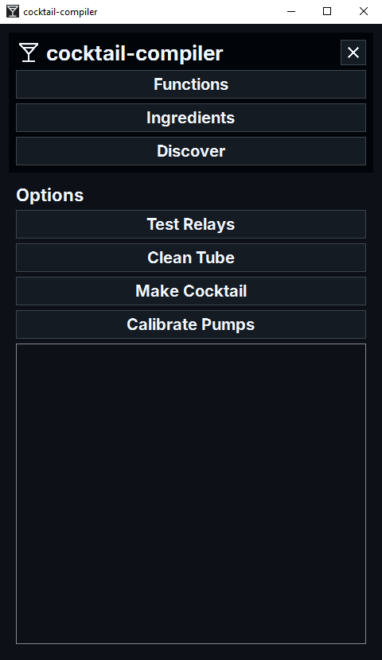
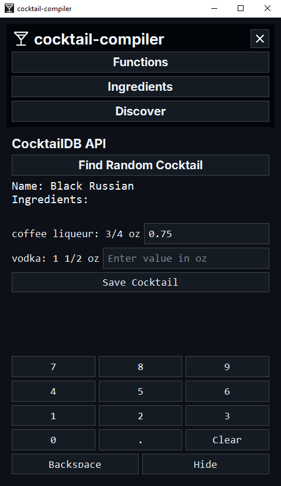

# cocktail-compiler

This repository is used for testing the pumps and Raspberry Pi functionality for the Cocktail Compiler project. The project aims to automate the process of making cocktails using a Raspberry Pi and connected pumps.

## Images

<div style="display: flex; justify-content: space-around;">
    
    
    
</div>

## Setup

1. Clone the repository:
    ```sh
    git clone https://github.com/yourusername/cocktail-compiler.git
    cd cocktail-compiler
    ```

2. Set up your Raspberry Pi with the necessary GPIO configurations.

3. Install the required Python packages:
    ```sh
    pip install -r requirements.txt
    ```

## Dependencies

- certifi==2025.1.31
- charset-normalizer==3.4.1
- idna==3.10
- PyQt6==6.8.1
- PyQt6-Qt6==6.8.2
- PyQt6_sip==13.10.0
- qt6-applications==6.5.0.2.3
- requests==2.32.3
- urllib3==2.3.0

## Usage

1. Ensure your Raspberry Pi is properly connected to the pumps via GPIO pins.

2. Run the `main.py` script to test the pumps:
    ```sh
    python3 gui/main.py
    ```

**Note:** Ensure you follow all safety guidelines when working with electrical components and liquids.
